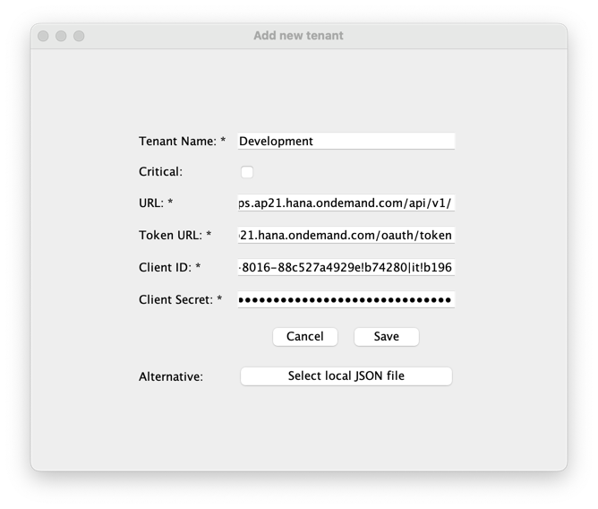
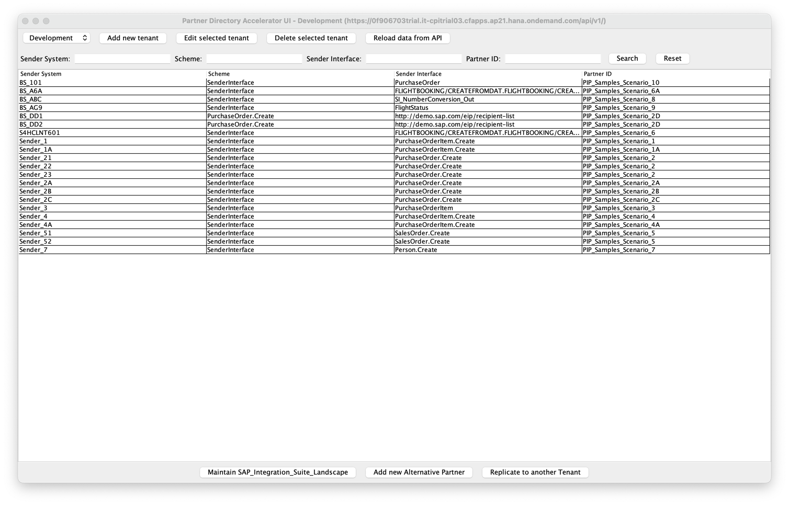
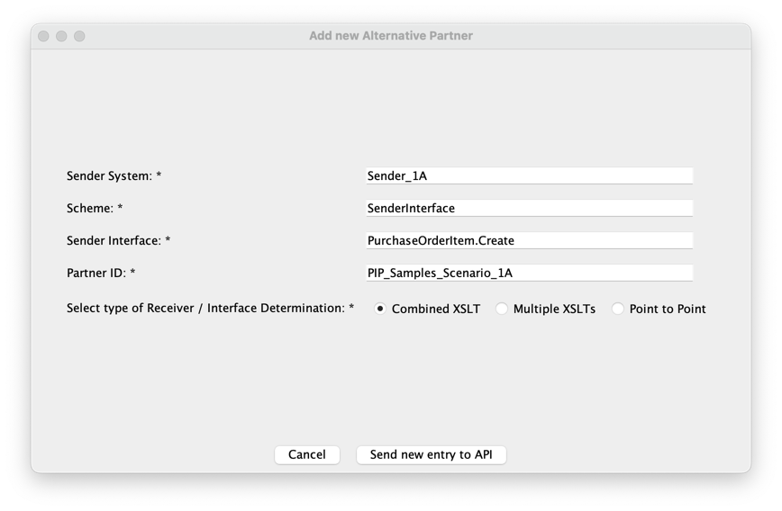
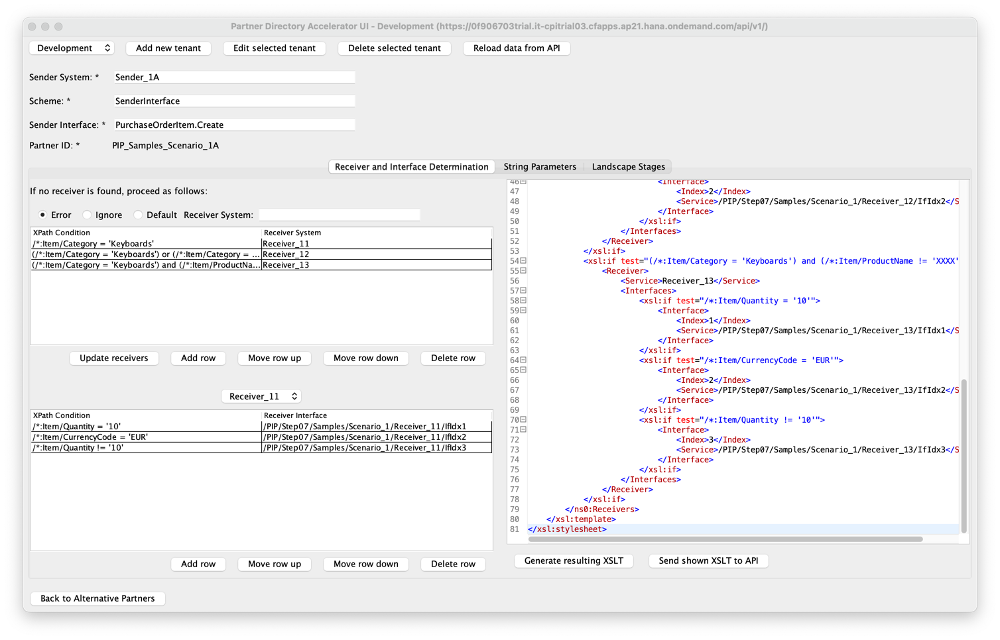
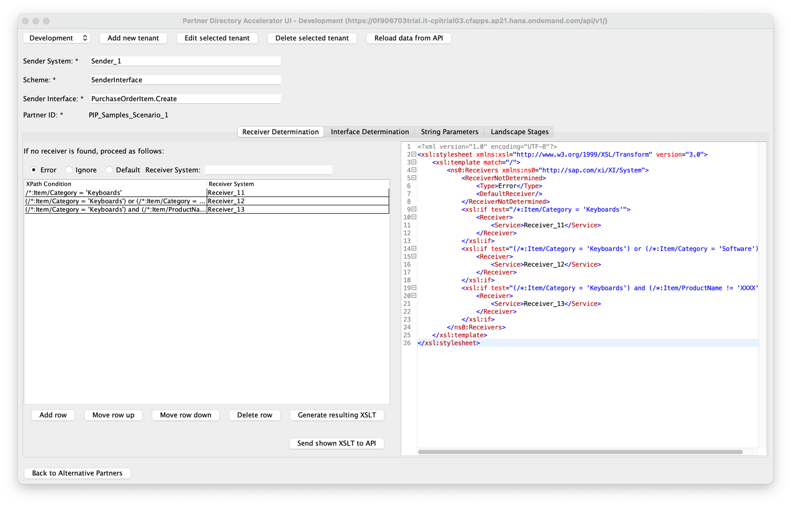
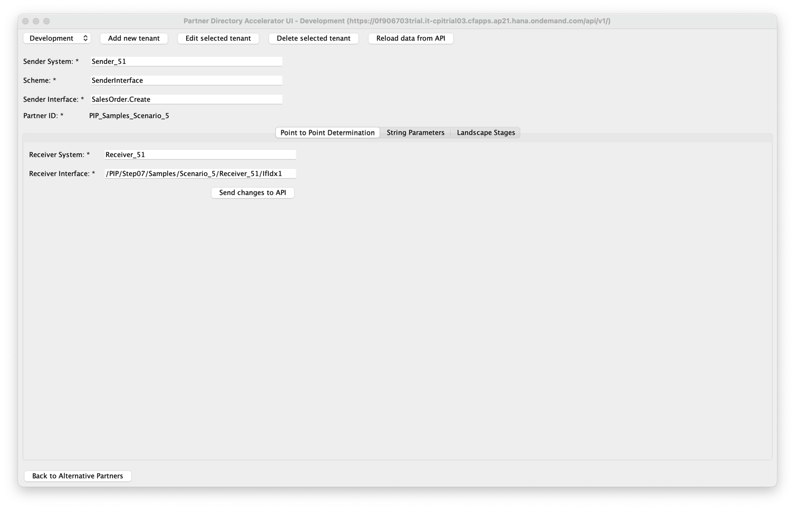
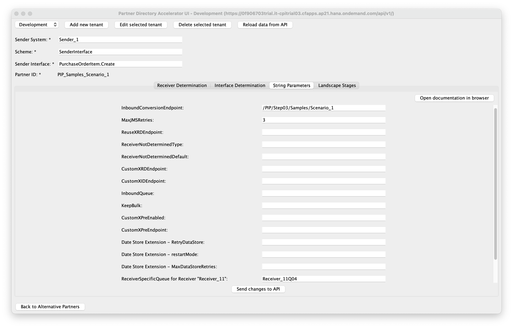
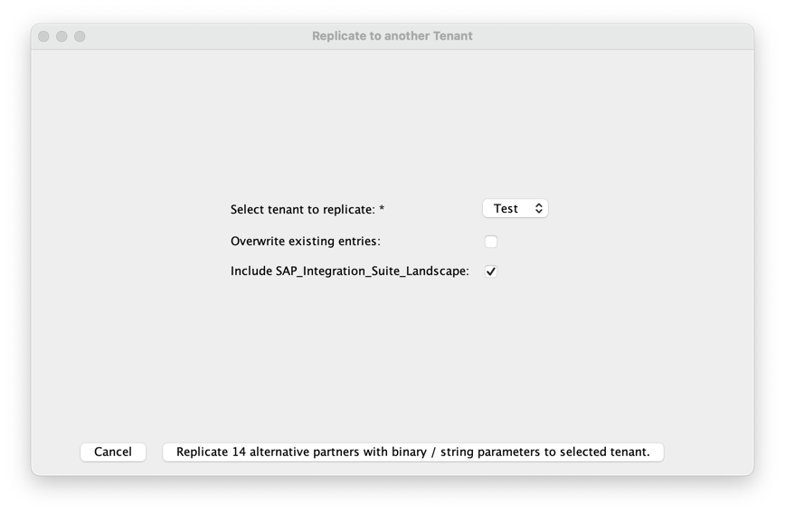

# Partner Directory Accelerator for Pipeline Concept

<!--- Register repository https://api.reuse.software/register, then add REUSE badge:
[](https://api.reuse.software/info/github.com/SAP-samples/REPO-NAME)
-->

## Description

This tool supports the [Pipeline Concept](https://community.sap.com/t5/technology-blogs-by-sap/introducing-the-new-pipeline-concept-in-cloud-integration/ba-p/13639651), which helps customers to migrate from their on-premise Process Integration / Process Orchestration systems to the cloud-based SAP Integration Suite. The Pipeline Concept relies on the [Partner Directory](https://help.sap.com/docs/cloud-integration/sap-cloud-integration/partner-directory-api), which contains configuration on message processing behavior, and dynamically reads the Partner Directory content at runtime.

The purpose of this tool is to simplify the interaction with the Partner Directory for the Pipeline Concept by providing a UI. To do so, access to a tenant's API needs to be configured, so you can read, create and update Partner Directory entries which are used for the Pipeline Concept (other Partner Directory entries are not shown here). Key features are the XSLT generation and maintenance from a tabular input format, as well as the replication of Partner Directory content in different tenants of a landscape.

Before using this tool, please make yourself familiar with the Pipeline Concept. An introduction to the Pipeline Concept can be found in this [SAP Community blog](https://community.sap.com/t5/technology-blogs-by-sap/introducing-the-new-pipeline-concept-in-cloud-integration/ba-p/13639651). Being used for the Pipeline Concept, the [documentation](https://help.sap.com/docs/migration-guide-po/migration-guide-for-sap-process-orchestration/using-partner-directory-in-pipeline-concept) provides further information on the Partner Directory. The tool is written in Java 17 and uses the Partner Directory API to provide a Java Swing UI for simple user interaction with the Partner Directory content. More information about this API is available on the [Business Accelerator Hub](https://hub.sap.com/api/PartnerDirectory/overview).

## Table of Content

* [Description](#description)
* [Table of Content](#table-of-content)
* [Requirements](#requirements)
* [Download and Installation](#download-and-installation)
    + [On Windows](#on-windows)
    + [On Unix / macOS](#on-unix--macos)
* [Usage of the tool](#usage-of-the-tool)
    + [Header Buttons](#header-buttons)
        - [Tenant dropdown menu](#tenant-dropdown-menu)
        - [Add new tenant](#add-new-tenant)
        - [Edit selected tenant](#edit-selected-tenant)
        - [Reload data from API](#reload-data-from-api)
    + [Alternative Partners Page](#alternative-partners-page)
        - [Search option](#search-option)
        - [Alternative Partners Table](#alternative-partners-table)
        - [Add New Alternative Partner](#add-new-alternative-partner)
        - [Replication to another Tenant](#replication-to-another-tenant)
    + [Parameters Page](#parameters-page)
        - [Headers for Alternative Partner](#headers-for-alternative-partner)
        - [Option 1: Combined XSLT](#option-1-combined-xslt)
        - [Option 2: Multiple XSLTs](#option-2-multiple-xslts)
            * [Receiver Determination](#receiver-determination)
            * [Interface Determination](#interface-determination)
        - [Option 3: Point to Point](#option-3-point-to-point)
        - [String Parameters](#string-parameters)
    + [Replication Page](#replication-page)
        - [Replication Table](#replication-table)
        - [(De)Select all shown entries](#deselect-all-shown-entries)
        - [Replication to another Tenant](#replication-to-another-tenant-1)
* [Troubleshooting](#troubleshooting)
    + [Error when configuring API: (certificate_unknown) PKIX path building failed: sun.security.provider.certpath.SunCertPathBuilderException: unable to find valid certification path to requested target](#error-when-configuring-api-certificate_unknown-pkix-path-building-failed-sunsecurityprovidercertpathsuncertpathbuilderexception-unable-to-find-valid-certification-path-to-requested-target)
    + [Error when configuring API: JSONObject["d"] not found / <br/> Error when configuring API: A JSONObject text must begin with '{' at 1 [character 2 line 1] / <br/> Error when configuring API: URI with undefined scheme](#error-when-configuring-api-jsonobjectd-not-found--br-error-when-configuring-api-a-jsonobject-text-must-begin-with--at-1-character-2-line-1--br-error-when-configuring-api-uri-with-undefined-scheme)
    + [Error when generating XSLT from input data. If "Default" is selected as the behavior when no receiver is found, the Default Receiver System must be specified in the corresponding input field.](#error-when-generating-xslt-from-input-data-if-default-is-selected-as-the-behavior-when-no-receiver-is-found-the-default-receiver-system-must-be-specified-in-the-corresponding-input-field)
    + [Error when generating XSLT from input data. Table which is missing data: [name of table]](#error-when-generating-xslt-from-input-data-table-which-is-missing-data-name-of-table)
    + [Error when generating XSLT from input data. Make sure that all tables and the receiver not found section are filled properly.](#error-when-generating-xslt-from-input-data-make-sure-that-all-tables-and-the-receiver-not-found-section-are-filled-properly)
    + [The generated XSLT might contain invalid syntax: (...) / <br/> The shown XSLT might contain invalid syntax:  (...) Do you want to send the shown XSLT to the API anyway?](#the-generated-xslt-might-contain-invalid-syntax----the-shown-xslt-might-contain-invalid-syntax---do-you-want-to-send-the-shown-xslt-to-the-api-anyway)
* [How to obtain support](#how-to-obtain-support)
* [Contributing](#contributing)
    + [XSLT Handling](#xslt-handling)
    + [JAR Generation](#jar-generation)
* [License](#license)

## Requirements

The tool is built using OpenJDK 17 by SapMachine, which is required and can be downloaded [here](https://sap.github.io/SapMachine/).

As a web-based alternative, the SAP Business Application Studio can be used. A tutorial on how to set it up can be found [here](https://developers.sap.com/tutorials/appstudio-onboarding.html). A dev space of type "Basic" includes everything needed to run the tool.

## Download and Installation

Please download the latest version of the tool from the [releases section](../../releases/latest).

The runnable file is called [`PartnerDirectoryAcceleratorUI-1.0-SNAPSHOT-jar-with-dependencies.jar`](PartnerDirectoryAcceleratorUI-1.0-SNAPSHOT-jar-with-dependencies.jar). Additionally, there is a start script called [`start.bat`](start.bat) / [`start.sh`](start.sh).

Depending on your operating system, run one of the following commands from the terminal or command prompt:

### On Windows

```sh
./start.bat
```

### On Unix / macOS

```sh
chmod +x start.sh
./start.sh
```

## Usage of the tool

To ensure you always see the latest data, this tool sends HTTP requests each time a new page is displayed or another tab is selected. Therefore, depending on your network connection, you might need to be a bit patient...

The following images show the tool with sample scenarios available in a [GitHub repository by Alexander Bundschuh](https://github.com/peasantsboot/ProcessIntegrationPipelineSampleScenarios).

### Header Buttons

#### Tenant dropdown menu

In this tool, credentials to different tenants can be added. The idea is to easily allow switching between multiple tenants. If you haven't added a tenant before, the dropdown menu shows the label "Add new tenant first...", which is explained [in the next section](#add-new-tenant).

To provide this support of multiple tenants, a file called `tenants.json` is created when starting the tool, which is located in the same directory as the `.jar` file. **This file is automatically generated and contains sensitive data. Please do not share this file and please do not change the content of this file.**

#### Add new tenant



The "Add new tenant" button allows you to specify the URL to the Partner Directory API from which you want the data to be displayed. To configure the API, the credentials of a service key from the BTP is required, which you can either manually fill into the input fields or upload the local JSON file from your device which contains the service key. In the BTP cockpit, from your subaccount, navigate to Services > Instances and Subscriptions > Instances. An instance of the service **SAP Process Integration Runtime** with plan **api** and the role **AuthGroup_TenantPartnerDirectoryConfigurator** needs to exist, with a service key containing all required credentials. For more information, please refer to the [documentation](https://help.sap.com/docs/integration-suite/sap-integration-suite/creating-service-instance-and-service-key-for-inbound-authentication).

**Manual input** allows you to fill out the input fields:
* **`Tenant Name`**: Here you can add any name for the tenant you are adding. Please make sure that the tenant name is unique for all the tenants you added.
* **`Critical`**: With this checkbox, you can e.g. mark productive tenants. For critical tenants, the header bar of the UI is colored in red.
* **`URL`**: The URL to access the Partner Directory API, usually ending with `.hana.ondemand.com`. The string `/api/v1/` must be added here. Please make sure that the URL is unique for all the tenants you added.
* **`Token URL`**: This URL is called to get the token, it usually ends with `/oauth/token`, which should be included here as it is shown in the BTP.
* **`Client ID`**: The client ID is required to get an OAuth token and can be seen in the service instance credentials in the BTP.
* **`Client Secret`**: The client secret is required to get an OAuth token and can be seen in the service instance credentials in the BTP.

**Select local JSON file** can be used as an alternative to manual input. Here, you can click the button to select a local JSON file. The service key can directly be downloaded from the BTP: from your subaccount, navigate to Services > Instances and Subscriptions > Instances. To download the credentials as JSON file, first click on the name of your service key and then choose the download button. You still need to add a tenant name.

For easier usage, you can **specify the location of your local JSON file** in the `start.bat` or `shart.sh` script before you [run the tool](#download-and-installation). To do so, simply add the relative or local path to the JSON file at the end (surrounded by quotation marks if the path includes spaces). If you add the path to credentials of a tenant which is already configured, this tenant is automatically selected for your initial view. Otherwise, if you haven't added this tenant before, it is added to your list of tenants, and you can [edit](#edit-selected-tenant) it.

If you are facing errors while configuring the API, please refer to the section [Troubleshooting](#troubleshooting).

#### Edit selected tenant

The "Edit selected tenant" button gives you the option to edit the tenant which you have currently selected. E.g., you can update outdated credentials, give it a different name, or (un)mark it as critical. The meaning of the input fields is explained [above](#add-new-tenant).

#### Reload data from API

The "Reload data from API" button can be used to get the latest data from the API and display the latest alternative partners in the [table below](#alternative-partners-table).

### Alternative Partners Page



Once the API is configured, a table with all alternative partners is shown.

#### Search option

It is possible to search entries within the [alternative partners table](#alternative-partners-table). There is one search field present for each column. If values in multiple search fields are present, the table just shows entries which match all the search values. Searching is case-insensitive.

#### Alternative Partners Table

Since the tool is developed to support the Pipeline Concept, only these entries are shown for which the scheme equals "SenderInterface".

You can sort the entries of the table by clicking on the name of the column you want to sort by.

To edit an alternative partner and interact with the binary parameters and string parameters with the same Partner ID, click on a row of the table to navigate to its [parameters page](#parameters-page).

#### Add New Alternative Partner



At the bottom of the page, the "Add new Alternative Partner" button allows you to create a new entry for an alternative partner. Insert the required values: **Sender System** (named "agency" for alternative partner), **Sender Interface** (named "id" for alternative partner), and **Partner ID** (also known as PID). The value for "**Scheme**" is constantly set to "SenderInterface" because this is required for the Pipeline Concept.

Additionally, decide for a type of receiver / interface determination:
* **[Option 1: Combined XSLT](#option-1-combined-xslt)** is the default and allows you to have receiver and interface determinations combined in one single XSLT mapping, as released in version 1.0.8 of the Pipeline Concept.
* **[Option 2: Multiple XSLTs](#option-2-multiple-xslts)** results in one XSLT as receiver determination and additionally one XSLT as interface determination per receiver.
* **[Option 3: Point to Point](#option-3-point-to-point)** uses string parameters to define exactly one receiver and one interface, which came with version 1.0.6 of the Pipeline Concept.

> Please note that if you choose a type of receiver / interface determination but do not create any determination while the tool is running, this information will not be preserved upon restarting the tool. This is because the tool does not have a data store for the type of receiver / interface determination to retain information across multiple sessions.

By sending the data to the API, a new alternative partner is created and shown in the [alternative partners table](#alternative-partners-table). Please note that after creating a new alternative partner, it is not possible to change the Partner ID (PID) in this UI tool. By clicking on your newly created entry in the table, you can also add binary parameters and string parameters.

#### Replication to another Tenant

By clicking the "Replication to another Tenant" button, the view is switched to the [Replication page](#replication-page).

### Parameters Page

On the parameters page, you can create and update all binary parameters and string parameters having the same Partner ID as the selected one. It is also possible to update the selected alternative partner. Only these binary parameters are shown for which the "ContentType" equals "xsl".

#### Headers for Alternative Partner

On the upper part of the page, you can update the values for Sender System (named "agency" for alternative partner) and Sender Interface (named "id" for alternative partner). Both Scheme and Partner ID are constant after creation. Once a value is changed, buttons to send and discard the changes on the alternative partner are shown.

#### Option 1: Combined XSLT



In the "Receiver and Interface Determination" tab, a combined XSLT mapping for both receiver and interface determination can be created.

For the receiver determination, it consists of two parts: the processing if no receiver is found (represented by radio buttons) and conditions with resulting receivers (represented by a table). If no receiver is found, the options "Error", "Ignore", and "Default" are available. In case the "Default" option is selected, a default receiver system needs to be specified. In the table, conditions and resulting receiver systems can be specified. It is possible to add new rows, move a selected row up or down, and delete a selected row.

For each receiver specified in the receiver determination, an interface determination should be present. First, select the receiver for which you want to see the interface determination. The radio buttons contain all receiver systems present in the receiver determination. In the table, conditions and resulting receiver interfaces can be specified. It is possible to add new rows, move a selected row up or down, and delete a selected row.

By clicking the "Generate resulting XSLT" button, the information from the table on the left-hand side is read to generate an XSLT based on this data and show it on the right-hand side. Now, the newly generated XSLT can be sent to the API.

If you get an invalid syntax warning, please refer to the [troubleshooting section](#the-generated-xslt-might-contain-invalid-syntax----the-shown-xslt-might-contain-invalid-syntax---do-you-want-to-send-the-shown-xslt-to-the-api-anyway).

> Please note that by clicking the "Send shown XSLT to API" button, always the XSLT mapping shown on the right-hand side is sent to the API. In case this differs from the data in the tables, the data in the tables is not considered.

#### Option 2: Multiple XSLTs

##### Receiver Determination



In the "Receiver Determination" tab, an XSLT mapping to determine the receiver can be created or edited. It consists of two parts: the processing if no receiver is found (represented by radio buttons) and conditions with resulting receivers (represented by a table).

If no receiver is found, the options "Error", "Ignore", and "Default" are available. In case the "Default" option is selected, a default receiver system needs to be specified.

In the table, conditions and resulting receiver systems can be specified. It is possible to add new rows, move a selected row up or down, and delete a selected row.

By clicking the "Generate resulting XSLT" button, all information from the left-hand side, including the radio buttons and the table, are read to generate an XSLT based on this data and show it on the right-hand side. Now, the newly generated XSLT can be sent to the API.

If you get an invalid syntax warning, please refer to the [troubleshooting section](#the-generated-xslt-might-contain-invalid-syntax----the-shown-xslt-might-contain-invalid-syntax---do-you-want-to-send-the-shown-xslt-to-the-api-anyway).

> Please note that by clicking the "Send shown XSLT to API" button, always the receiver determination shown on the right-hand side is sent to the API. In case this differs from the data in the table, the data in the table is not considered.

##### Interface Determination


In the "Interface Determination" tab, XSLT mappings to determine the interface for each possible receiver can be created or edited. For each receiver specified in the receiver determination, an interface determination should be present.

First, select the receiver for which you want to see the interface determination. The radio buttons contain all receiver systems present in the receiver determination.

In the table, conditions and resulting receiver interfaces can be specified. It is possible to add new rows, move a selected row up or down, and delete a selected row.

By clicking the "Generate resulting XSLT" button, the information from the table on the left-hand side is read to generate an XSLT based on this data and show it on the right-hand side. Now, the newly generated XSLT can be sent to the API.

If you get an invalid syntax warning, please refer to the [troubleshooting section](#the-generated-xslt-might-contain-invalid-syntax----the-shown-xslt-might-contain-invalid-syntax---do-you-want-to-send-the-shown-xslt-to-the-api-anyway).

> Please note that by clicking the "Send shown XSLT to API" button, always the interface determination shown on the right-hand side is sent to the API. In case this differs from the data in the table, the data in the table is not considered.

#### Option 3: Point to Point



In the "Point to Point Determination" tab, exactly one receiver system and one receiver interface can be specified.

By clicking the "Send changes to API" button, existing string parameters starting with the IDs "receiverDetermination" and "interfaceDetermination_" are deleted. Then, the values from the input fields are sent to the API.

#### String Parameters



In the "String Parameters" tab, the string parameters can be added, updated, and deleted by entering the desired value in the input field of the corresponding ID.

All string parameters relevant to the Pipeline Concept are listed in the [documentation](https://help.sap.com/docs/migration-guide-po/migration-guide-for-sap-process-orchestration/using-partner-directory-in-pipeline-concept#message-processing-behavior).

To implement [Point-to-Point scenarios](https://help.sap.com/docs/migration-guide-po/migration-guide-for-sap-process-orchestration/using-partner-directory-in-pipeline-concept#special-case%3A-point-to-point-scenarios), please select this option when [adding a new alternative partner](#add-new-alternative-partner).

By clicking the "Send changes to API" button, all values in the input fields are read and sent to the API to create or update the relevant string parameter. If an input field is empty, the relevant string parameter will be deleted if it exists.

### Replication Page

The idea of the replication page is to allow selecting multiple entries of the Partner Directory and create / update these entries in another tenant. In the replication page, multiple alternative partners can be selected. **For replicating, the selected alternative partners as well as the binary parameters and string parameters with the same Partner ID are replicated to another tenant.** A possible use case is to move the Partner Directory entries e.g. from a Dev tenant to QA to Prod. Please make sure that you have already added the target tenant which you want to replicate to.

#### Replication Table


The replication table shows alternative partners (similar to the [alternative partners table](#alternative-partners-table)) and is extended by a checkbox column. By clicking a checkbox in a row, the alternative partner is selected for replication.

#### (De)Select all shown entries

The buttons "Deselect all shown entries" and "Select all shown entries" on the bottom allow to (de)select multiple alternative partners at once. This can be used in combination with the [search option](#search-option) which with you can filter for specific entries and select all these filtered entries at once.

#### Replication to another Tenant



Once you have selected all alternative partners to replicate, you can click on "Replicate to another Tenant". By using the dropdown menu, you need to select your target tenant from the list of tenants you previously added.

You can decide to overwrite entries which already exist in the target tenant. If the checkbox is not checked, only HTTP Post requests are sent to create new entries. If the combination of keys of an entry already exist, the request will fail. In contrast, if the checkbox is checked, an HTTP Post request is sent at first. If the combination of keys already exist, the tools sends an additional HTTP Put request to overwrite the existing entry in the target tenant.

The button "Replicate x alternative partners with binary / string parameters to selected tenant" starts the replication to the selected tenant. Depending (among others) on the number of replicated entries and your network connection, this can take some time. During replication, you can see details in the logs. Once finished, the view is switched to the [alternative partners page](#alternative-partners-page) of the target tenant.

## Troubleshooting

### Error when configuring API: (certificate_unknown) PKIX path building failed: sun.security.provider.certpath.SunCertPathBuilderException: unable to find valid certification path to requested target

This error can occur when you try to send the initial HTTP request but a certificate is missing. To resolve the error, you need to import the SSL certificate of the SAP Integration Suite into the local JRE keystore. To do so, download the certificate from SAP Integration Suite URL and store it on your local device. Then, import the certificate into your local JRE keystore, as explained in [this guide](https://www.ibm.com/docs/en/cognos-tm1/10.2.2?topic=ictocyoiatwas-add-certificates-jre-keystore).

### Error when configuring API: JSONObject["d"] not found / <br/> Error when configuring API: A JSONObject text must begin with '{' at 1 [character 2 line 1] / <br/> Error when configuring API: URI with undefined scheme

This error can occur when the initial HTTP request fails. Please double-check that the credentials you provided meet the requirements described in the previous section [Add new tenant](#add-new-tenant) and check for typos in the credentials.

### Error when generating XSLT from input data. If "Default" is selected as the behavior when no receiver is found, the Default Receiver System must be specified in the corresponding input field.

This error is related to the section "If no receiver is found, proceed as follows:" in the UI. Here, you can select what to do if no receiver is found. Specifically, this can either cause an error, be ignored, or a default receiver system is specified. The error occurs if "Default" is selected but no default receiver system is specified in the input field.

### Error when generating XSLT from input data. Table which is missing data: [name of table]

The error occurs if either no receiver system is specified in a table for receiver determination or no receiver interface is specified in a table for interface determination. A XPath condition is not required. The error message shows the name of the table which caused the error. Attention: in case the error occurs while generating a Combined XSLT, the table which is missing data might not be visible in the UI but can be shown by selecting the corresponding radio button.

### Error when generating XSLT from input data. Make sure that all tables and the receiver not found section are filled properly.

This error occurs in general if data is missing for generating the XSLT and no more specific error could be provided. Please make sure that all data is filled properly.

### The generated XSLT might contain invalid syntax: (...) / <br/> The shown XSLT might contain invalid syntax:  (...) Do you want to send the shown XSLT to the API anyway?

When generating an XSLT or trying to send it to the API, a syntax validation check is performed in the background using the [Saxon XSLT Processor](https://www.saxonica.com/welcome/welcome.xml). If the syntax check passes, the XSLT is directly shown / sent to the API. If the syntax check fails, a dialog with details is shown. The recommendation is to review and edit the input data and regenerate the XSLT with valid syntax.

> Please note that the results of this syntax check may differ from those obtained when processing the XSLT files within SAP Integration Suite itself. The syntax validation performed by this tool is intended to be a useful aid, but it does not guarantee absolute correctness or compatibility with SAP Integration Suite. Therefore, it is recommended to thoroughly test your XSLT files in the actual SAP Integration Suite environment to ensure proper functionality.

## Known Issues

Currently, there are some limits which the tool is not capable of:

* **Deletion** of existing alternative partners and binary parameters is not possible. String parameters can be deleted. To delete existing entries, the [Partner Directory API](https://hub.sap.com/api/PartnerDirectory/overview) or the [Partner Directory UI](https://help.sap.com/docs/integration-suite/sap-integration-suite/managing-partner-directory-entries?version=CLOUD) can be used.
* **Header parameter** such as <xsl:param name="dc_country"/> or <xsl:param name="SAP_SenderOperation"/> cannot be maintained in an XSLT.
* [**Landscape stages**](https://help.sap.com/docs/migration-guide-po/migration-guide-for-sap-process-orchestration/landscape-stages) using the string parameter SAP_Integration_Suite_Landscape are not supported as it was introduced in version 1.0.9 of the Pipeline Concept.

## Development

### XSLT Handling

The UI of the tool is built using Java Swing. All classes related to the UI can be found in the folder [`src/main/java/org/example/ui`](src/main/java/org/example/ui).

For generating XSLT outputs, the template engine [Apache FreeMarker](https://freemarker.apache.org/index.html) is used. The templates can be found in the folder [`src/main/resources/templates`](src/main/resources/templates). These templates take objects from the folder [`src/main/java/org/example/templates`](src/main/java/org/example/templates) to transform them into XSLTs.

The other way around, for existing XSLTs, the data is extracted to a table by using XPath expressions.

### JAR Generation

If you make changes to the code, you can generate a new `.jar` file by running the following terminal command in the root directory of the project. Two `.jar` files will be generated. Note that only the file `PartnerDirectoryAcceleratorTool-1.0-SNAPSHOT-jar-with-dependencies.jar` contains all the necessary dependencies to run as a standalone application.

```
mvn clean package && cp target/PartnerDirectoryAcceleratorUI-1.0-SNAPSHOT-jar-with-dependencies.jar . && cp target/PartnerDirectoryAcceleratorUI-1.0-SNAPSHOT.jar .
```

In case you do not have the Maven command line installed, please follow [this guide](https://maven.apache.org/guides/getting-started/maven-in-five-minutes.html#installation).

## How to obtain support

[Create an issue](../../issues) in this repository if you find a bug or have questions about the content.

For additional support, [ask a question in SAP Community](https://answers.sap.com/questions/ask.html).

## Contributing

If you wish to contribute code, offer fixes or improvements, please send a pull request. Due to legal reasons, contributors will be asked to accept a DCO when they create the first pull request to this project. This happens in an automated fashion during the submission process. SAP uses [the standard DCO text of the Linux Foundation](https://developercertificate.org/).

Information on how the tool is developed can be found [here](#development).

## License

Copyright (c) 2025 SAP SE or an SAP affiliate company. All rights reserved. This project is licensed under the Apache Software License, version 2.0 except as noted otherwise in the [LICENSE](LICENSE) file.
